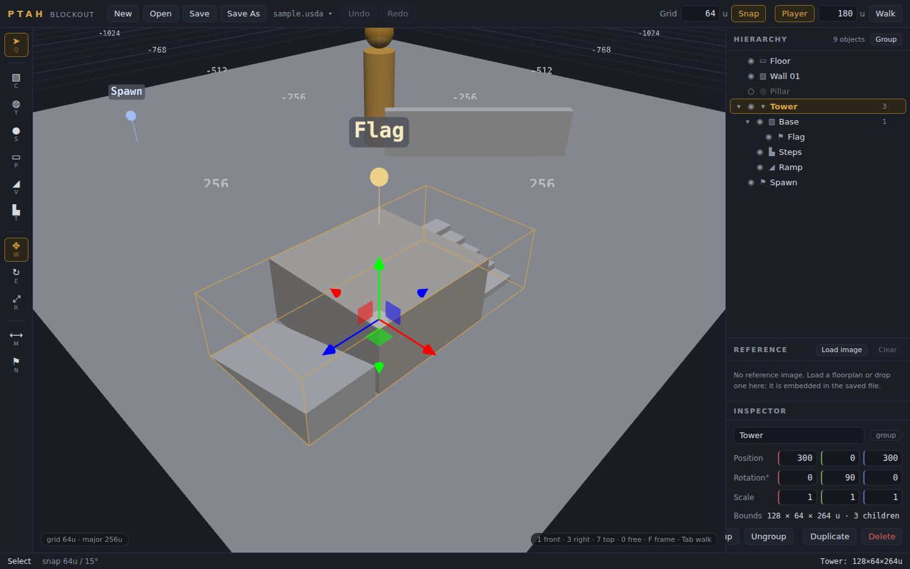
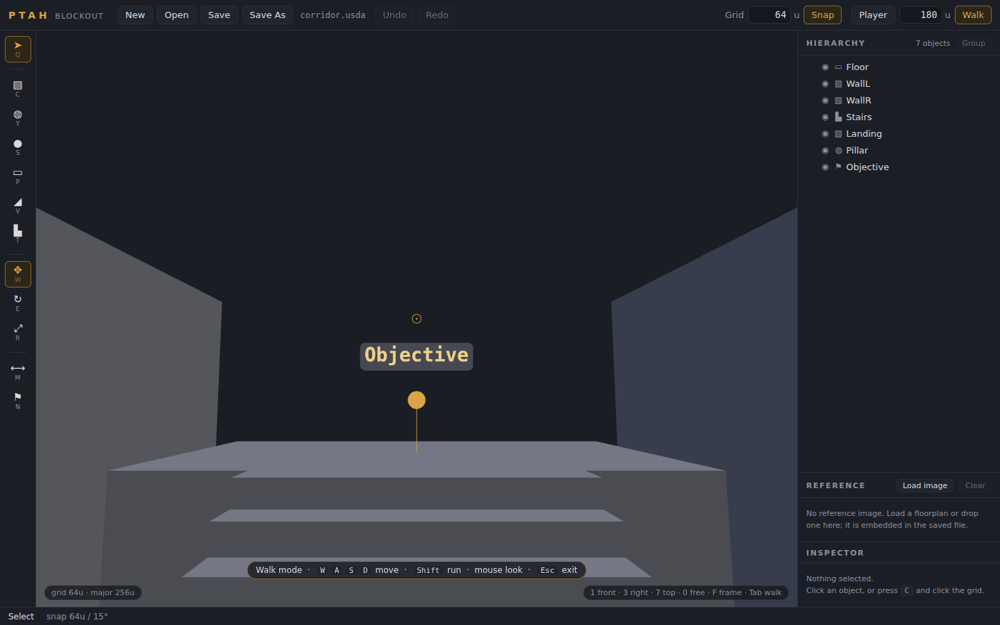

# Ptah

A 3D level blockout editor for game design students. Sketch layouts fast, measure them accurately, walk them at player height, and export USD (`.usda`) for Unity and Unreal.

Built with Three.js. Runs two ways from the same code:

- **Desktop app** (Electron): native file dialogs, unsaved-changes guard, installers for Windows, macOS and Linux.
- **Web build**: the `renderer/` folder served from any static host (GitHub Pages works). No installer, no code signing, nothing for students to update. Save and Open use the File System Access API in Chromium browsers and fall back to download / file picker elsewhere.

Fully offline either way: Three.js is vendored, there is no network access at runtime and no server.



## Quick start

```bash
npm install        # Electron, electron-builder, Playwright (dev machines only)
npm start          # desktop app
npm run web        # web build at http://localhost:8123
```

Build standalone desktop executables:

```bash
npm run dist           # current platform
npm run dist:win       # Windows (NSIS installer + portable)
npm run dist:mac       # macOS (dmg + zip)
npm run dist:linux     # Linux (AppImage + deb)
```

electron-builder cross-compiles Linux and Windows from Linux; macOS builds require a Mac. Tagging a commit `vX.Y.Z` builds all three in GitHub Actions and attaches them to a Release (see [Signing and distribution](#signing-and-distribution)).

## What you can do

- **Primitives**: cube, cylinder, sphere, plane, wedge (ramp) and stairs. Click to stamp, or drag to place. Stairs have an editable step count; rise = height ÷ steps.
- **Groups**: `Ctrl+G` groups the selection, `Ctrl+Shift+G` ungroups. Drag rows in the Hierarchy to reparent or reorder (before, after, or into). World positions never change when you regroup; only the local numbers do, exactly as in Unity or Unreal.
- **Multi-select**: `Shift+click` (viewport or Hierarchy), drag a box on empty space, `Ctrl+A`. The gizmo moves, rotates or scales the whole set about its centroid.
- **Notes** (`N`): pin a note to a surface or the grid. Title and text live in the Inspector and export with the file. Engines import them as named empties, so a "spawn here" note becomes a locator.
- **Walk mode** (`Tab`): drop to player eye height and walk with `WASD`, `Shift` to run, mouse to look. Walls block you, stairs and ramps carry you up. `Esc` puts the camera back where it was.
- **Reference underlay**: load a floorplan sketch or paper map in the Reference panel (or drop an image on it), set its width in units, rotate and offset it, dim it. The image is downscaled and embedded in the `.usda`, so the file reopens anywhere.
- **Measure** (`M`): click two points, read the distance and the per-axis deltas.
- **Player marker** (`H`): a 180u reference figure (height editable) for scale checks.
- **Undo everything**: every edit, including grouping, reparenting, step count changes and reference settings, is on the undo stack.



## Keyboard reference

| Key | Action |
| --- | --- |
| Q / Esc | Select tool (Esc also deselects, exits walk mode) |
| C / Y / S / P | Place cube / cylinder / sphere / plane |
| V / T | Place wedge (ramp) / stairs |
| N | Place a note |
| W / E / R | Move / rotate / scale gizmo |
| G | Toggle grid snapping (position, rotation and size) |
| M | Measure tool: click two points |
| H | Toggle player height reference |
| F | Frame selection (or whole level) |
| Tab | Walk mode (WASD move, Shift run, mouse look) |
| 1 / 3 / 7 / 0 | Front / right / top / free camera (numpad or number row) |
| Shift+click | Add or remove from the selection |
| Drag on empty space | Box select |
| Ctrl+A | Select all |
| Ctrl+G / Ctrl+Shift+G | Group / ungroup |
| F2 | Rename selected (or double-click in Hierarchy) |
| Del | Delete selected |
| Ctrl+D | Duplicate (whole subtree) |
| Ctrl+Z / Ctrl+Shift+Z | Undo / redo |
| Ctrl+S / Ctrl+Shift+S | Save / Save As |
| Ctrl+O / Ctrl+N | Open / New (browsers reserve Ctrl+N; use the button) |
| MMB drag | Orbit camera |
| RMB drag | Pan camera |
| Scroll | Zoom |

## Units and scale

- 1 scene unit = 1 cm (`metersPerUnit = 0.01`, Y-up in the file). This matches Unreal units directly; Unity's USD importer converts to meters automatically.
- Default grid: 64 units, with major lines every 4 cells and distance labels along both axes.
- Player reference marker defaults to 180 units (1.8 m). Walk mode puts the eye at 93% of that.
- An object's **Size** in the inspector is its dimensions in units (base geometry is unit-sized; dimensions live in the scale op). **Bounds** is the world axis-aligned box of the object and its children, which differs from Size once something is rotated.
- A child inherits its parent's transform, scale included. Group with an empty group (`Ctrl+G`), which has scale 1, rather than parenting under a stretched cube, unless you want the stretch.

## USD pipeline notes

- Export writes plain-text `.usda`: an `Xform` per object carrying translate / rotateXYZ / scale, with a child `Mesh "Geom"` holding baked primitive geometry. Child objects are nested `Xform`s, so engines compose the hierarchy exactly as the editor shows it.
- Baked meshes were chosen over `Cube` / `Sphere` gprims because `Mesh` is the one prim type every importer handles identically. Stairs are generated watertight with no T-junctions so engine collision generation stays clean.
- Groups and notes are empty `Xform`s (`ptah:type = "group"` / `"note"`, note text in `ptah:text`). Both import into Unreal and Unity as named empties.
- `displayColor` is written per object so blocks stay visually distinct in Unreal, Unity and usdview.
- A `customData` tag (`ptah:type`) makes re-import lossless. Import also accepts foreign files: `Cube` / `Sphere` / `Cylinder` gprims map onto Ptah primitives, unknown `Mesh` prims load as generic meshes, plain `Xform`s with children become groups, `Scope` and `Material` prims are skipped.
- The reference underlay is stored in the stage's `customLayerData` (`ptah:reference`) and ignored by engines.
- Files written by v0.1 (flat hierarchy) open unchanged.
- **Unreal:** enable the *USD Importer* plugin, then import or use a USD Stage actor. Unreal is Z-up; the stage's declared Y-up is converted on import.
- **Unity:** install the *USD* package (`com.unity.formats.usd`), then Assets → Import USD.

## Architecture

```
main.js                  Electron main: window, native file dialogs (IPC), close guard
preload.js               contextBridge: saveUsd / openUsd / confirmDiscard / setTitle / setDirty
renderer/
  index.html             UI shell + import map for vendored Three.js
  manifest.webmanifest   installable web app metadata
  style.css              editor chrome
  js/app.js              scene graph, tools, selection, hierarchy, inspector, files
  js/usd.js              .usda writer/reader and primitive geometry: pure JS, no DOM
  js/platform.js         host abstraction: Electron IPC or browser APIs
  js/walk.js             first-person walk mode
  js/reference.js        reference image underlay
  js/history.js          undo/redo command stack
  vendor/                three.module.js + OrbitControls + TransformControls (r168)
test/
  usd.test.mjs           headless unit tests for usd.js
  scenario.mjs           the scripted editor session shared by both E2E runners
  e2e.browser.mjs        runs the scenario in headless Chromium (Playwright)
  smoke.js               runs the same scenario in Electron
  usd-validate.py        opens every .usda with Pixar usd-core
  make-samples.mjs       regenerates test/sample.usda from the exporter
  screenshots.mjs        regenerates the README images
build/                   icon and macOS entitlements for electron-builder
.github/workflows/       CI, GitHub Pages deploy, tagged releases
```

Scene graph model: every object is a record whose Three.js node *is* the USD `Xform` (a `Mesh` for geometry, a `Group` for groups and notes). Parenting is the Three.js parent/child relation, so the editor, the export and the engines compose transforms identically. The renderer runs sandboxed with context isolation; the only privileged surface is the handful of IPC calls in `preload.js`.

## Testing

```bash
npm test                                   # unit + browser E2E
npm run test:unit                          # USD layer: geometry manifolds, round trips, fixtures
npm run test:browser                       # web build in headless Chromium, screenshot in test/.out/
npm run test:smoke                         # same scenario under Electron (desktop)
npm run test:smoke:headless                # ... under xvfb on Linux
npm run test:usd-core                      # pip install usd-core first
```

The browser and Electron runners execute one shared script (`test/scenario.mjs`) that drives the real UI: placing every primitive, grouping, drag and drop reparenting, marquee selection, notes, walk mode, the reference underlay, and a full export → import → rebuild round trip, with undo and redo checked after each structural change.

`test/usd-validate.py` is the check our own parser cannot provide: Pixar's reference implementation opening what we write. It runs in CI on every push, over the checked-in samples and freshly exported files. Run it locally after any change to `usd.js`.

Hold the same bar when adding features: extend `scenario.mjs` for new interactions and `usd.test.mjs` for anything that touches the file format.

## Signing and distribution

Three options, in order of least friction for students:

1. **Web build.** Push to `main` and the `Deploy web build` workflow publishes `renderer/` to GitHub Pages. Students open a URL. Chromium-based browsers get in-place Save; others get downloads.
2. **Unsigned desktop builds.** `npm run dist` or a `v*` tag. Windows shows a SmartScreen warning and macOS requires right-click → Open the first time. Fine for a lab image, poor for take-home.
3. **Signed desktop builds.** Add repository secrets and the release workflow signs (and on macOS notarizes) automatically:
   - Windows: `CSC_LINK` (base64 `.pfx` or an https URL) and `CSC_KEY_PASSWORD`, or configure Azure Trusted Signing under `build.win.azureSignOptions` in `package.json`.
   - macOS: `CSC_LINK` / `CSC_KEY_PASSWORD` for a Developer ID Application certificate, plus `APPLE_ID`, `APPLE_APP_SPECIFIC_PASSWORD` and `APPLE_TEAM_ID` for notarization. The hardened runtime and entitlements are already configured in `build/`.

Certificates for a university-owned app are typically issued through the institution's developer program membership; check with the office that holds SMU's Apple Developer and Microsoft accounts before buying one.

## Known limitations (v0.2)

- Rotation round-trips exactly for our own files; multi-axis euler conventions from other DCCs may need checking against usdview.
- Non-uniform parent scale combined with a rotated child produces shear, in the editor and in engines alike. This is standard scene-graph behavior, not a bug, but it can surprise students.
- Walk mode has no jumping or crouching and does not collide with the top of anything above knee height; it is a scale and sightline check, not a character controller.
- Multi-selection shows combined bounds and lets you color, move, rotate, scale, group, duplicate and delete, but numeric fields edit one object at a time.
- The web build's Save writes in place only in Chromium-based browsers (File System Access API); Firefox and Safari download a copy each time.
