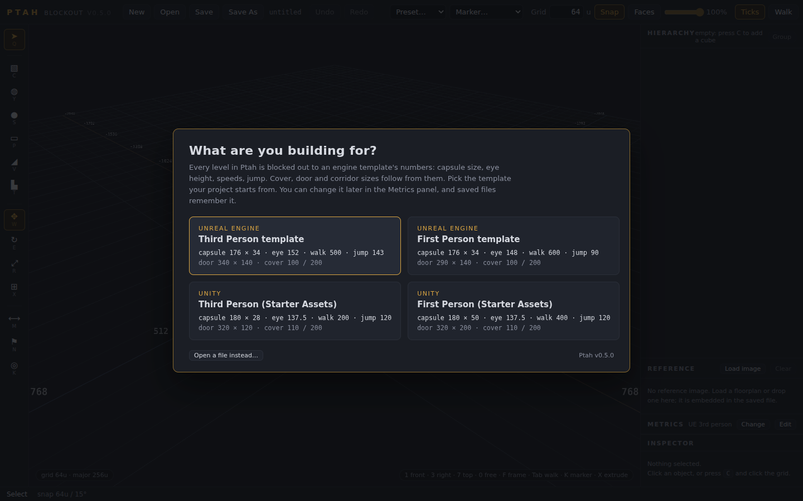
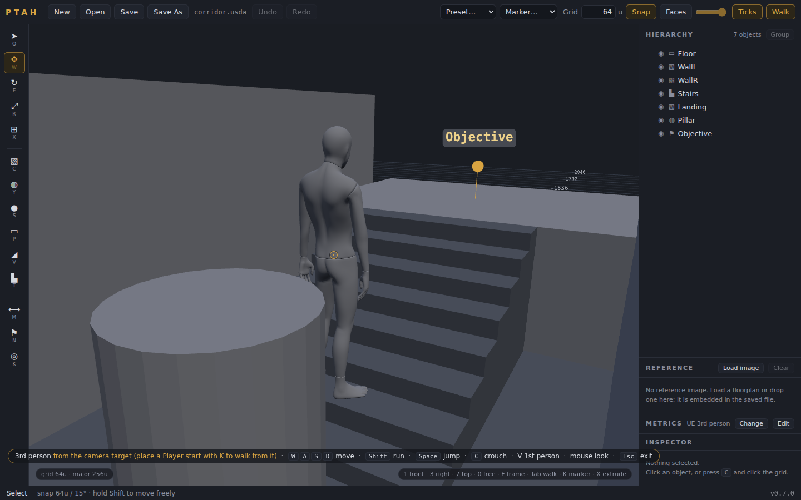

# Ptah

A 3D level blockout editor for game design students. Block out to real design metrics, tag every piece with its intent, mark spawns and triggers, walk it at player height, and export USD (`.usda`) that lands in Unity and Unreal as geometry plus gameplay data.

Built with Three.js. Runs two ways from the same code:

- **Desktop app** (Electron): native file dialogs, unsaved-changes guard, installers for Windows, macOS and Linux.
- **Web build**: the `renderer/` folder served from any static host (GitHub Pages works). No installer, no code signing, nothing for students to update. Save and Open use the File System Access API in Chromium browsers and fall back to download / file picker elsewhere.

Fully offline either way: Three.js is vendored, there is no network access at runtime and no server.


## Quick start

```bash
npm install        # Electron, electron-builder, Playwright (dev machines only)
npm start          # desktop app
npm run web        # web build at http://localhost:8123
```

Build standalone desktop executables:

```bash
npm run dist           # current platform
npm run dist:win       # Windows (NSIS installer + portable)
npm run dist:mac       # macOS (dmg + zip)
npm run dist:linux     # Linux (AppImage + deb)
```

electron-builder cross-compiles Linux and Windows from Linux; macOS builds require a Mac. Tagging a commit `vX.Y.Z` builds all three in GitHub Actions and attaches them to a Release (see [Signing and distribution](#signing-and-distribution)).

## Launching

Double-click the launcher for your system in the Ptah folder: `Launch Ptah.command` (macOS), `Launch Ptah.bat` (Windows) or `launch-ptah.sh` (Linux; choose "Run in Terminal" if your file manager asks, or use `Ptah.desktop`). It starts the built-in server and opens the editor in your default browser; leave the small terminal window open while you work. The only requirement is [Node.js](https://nodejs.org) 20 or newer, which the launcher checks for. From a terminal, `npm run web` does the same thing without opening the browser.

The desktop app (`npm start`, or the installers from `npm run dist`) needs no browser and no terminal at all; see `HANDOFF.md` for its status.

## Pick a profile first

A new level starts with one question: what are you building for? Unreal Engine Third Person, Unreal Engine First Person, Unity Third Person or Unity First Person (the Starter Assets). Ptah loads that template's capsule size, eye height, speeds, jump and step, derives cover, door and corridor sizes from them, and everything else in the editor reads those numbers: presets, marker capsules and their ticks, walk mode. Files remember the profile, so opening one never asks; Metrics → Change switches later.



## What you can do

- **Primitives**: cube, cylinder, sphere, plane, wedge (ramp) and stairs. Click to stamp, or drag to place. Stairs have an editable step count; rise = height ÷ steps.
- **Groups**: `Ctrl+G` groups the selection, `Ctrl+Shift+G` ungroups. Drag rows in the Hierarchy to reparent or reorder (before, after, or into). World positions never change when you regroup; only the local numbers do, exactly as in Unity or Unreal.
- **Multi-select**: `Shift+click` (viewport or Hierarchy), drag a box on empty space, `Ctrl+A`. The gizmo moves, rotates or scales the whole set about its centroid.
- **Metrics** (sidebar panel): the profile the level is built to, editable. Player height and capsule radius, eye, crouch and step heights, walk and run speed, jump height and distance, and the derived half and full cover, door and corridor sizes. Editing a number makes the profile Custom; Reset returns to the template. Saved in the file.
- **Presets** (topbar picker): Half cover, Full cover, Doorway, Corridor, Step run, sized from the metrics and tagged with the matching intent. Click the grid to place.
- **Intent** (Inspector swatches): every object carries one of eight intents (Floor, Wall, Cover, Blocker, Water, Hazard, Interactive, Placeholder). The color is the intent; the file carries both, so an environment artist reading the export knows what each block means.
- **Markers** (`◎` on the rail or `K`; pick the kind in the topbar Marker menu): PlayerStart and enemy Spawn (capsules at the profile's height and radius, with a facing arrow), Cover point, Objective, Trigger volume (Size is the box). Kind and free-form tags edit in the Inspector and export as attributes; `tools/` has scripts that turn them into engine actors.
- **Notes** (`N`): pin a note to a surface or the grid. Title and text live in the Inspector and export with the file. Engines import them as named empties.
- **Walk mode** (`Tab`): start at the selected Player start (or the first one, or the camera target if there is none), facing the way it faces, and walk with `WASD`, `Shift` to run, `Space` to jump, `C` to crouch, mouse to look. Walls block you, stairs and ramps carry you up; jump apex and reach follow the metrics. `Esc` puts the camera back where it was.
- **First or third person** (`V` while walking): third person shows a mannequin at the profile's player height on a boom camera behind it, the way the engine templates do: the mouse orbits, the character turns to face where it moves, the camera shortens against walls. Third-person profiles start in third person. The mannequin is a Mixamo character converted by `tools/mixamo/fbx2ptah.py` (see `renderer/assets/README.md`).
- **Extrude** (`X`): hover an axis-aligned face of any primitive and drag it along its normal. The opposite face stays put, so a wall grows from its end and a platform from its top. Snaps to the grid, one undo step.
- **Multi-object edits**: with several objects selected the numeric fields show the shared value (or a dash when mixed) and set every top-level object. Type `+=64`, `-=8`, `*=2` or `/=2` for relative changes. The `center` / `base` toggle beside Position makes the Y field read the object's bottom instead of its center.
- **Face snapping** (`Shift+G`): while dragging, faces within half a grid cell of another object's face snap flush: butt joints, alignment, stacking, highlighted with a plane.
- **Autosave**: a snapshot is kept a few seconds after every edit. Reopen after a crash and a bar offers it back.
- **Reference underlay**: load a floorplan sketch or paper map in the Reference panel (or drop an image on it), set its width in units, rotate and offset it, dim it. The image is downscaled and embedded in the `.usda`, so the file reopens anywhere.
- **Measure** (`M`): click two points, read the distance in units and meters and the per-axis deltas.
- **Ticks** (`H`): height ticks (player, eye, crouch, full and half cover, step) on every Player start and Spawn capsule, so any capsule doubles as a ruler next to the block you are sizing.
- **Grid opacity** (topbar slider): dim the grid to see a reference underlay; remembered between sessions.
- **Undo everything**: every edit, including grouping, reparenting, step count changes and reference settings, is on the undo stack.




## Keyboard reference

| Key | Action |
| --- | --- |
| Q | Select with no gizmo (keeps the selection) |
| Esc | Back to select with the current gizmo; deselects, exits walk mode |
| C / Y / S / P | Place cube / cylinder / sphere / plane |
| V / T | Place wedge (ramp) / stairs |
| N | Place a note |
| K | Place a marker (last kind picked; choose kinds in the topbar) |
| X | Extrude tool: drag an axis-aligned face along its normal |
| W / E / R | Select with the move / rotate / scale gizmo (one of Q W E R is active at a time) |
| G | Toggle grid snapping (edges to grid lines, rotation 15°, size in cells) |
| Shift (held) | Invert snapping while held: snap when off, move freely when on |
| Shift+G | Toggle face-to-face snapping while dragging |
| M | Measure tool: click two points |
| H | Toggle height ticks on capsule markers |
| F | Frame selection (or whole level) |
| Tab | Walk mode from the Player start (WASD move, Shift run, Space jump, C crouch, mouse look) |
| V (in walk mode) | Switch first / third person |
| 1 / 3 / 7 / 0 | Front / right / top / free camera (numpad or number row) |
| Shift+click | Add or remove from the selection |
| Drag on empty space | Box select |
| Ctrl+A | Select all |
| Ctrl+G / Ctrl+Shift+G | Group / ungroup |
| F2 | Rename selected (or double-click in Hierarchy) |
| Del | Delete selected |
| Ctrl+D | Duplicate (whole subtree) |
| Ctrl+Z / Ctrl+Shift+Z | Undo / redo |
| Ctrl+S / Ctrl+Shift+S | Save / Save As |
| Ctrl+O / Ctrl+N | Open / New (browsers reserve Ctrl+N; use the button) |
| MMB drag | Orbit camera |
| RMB drag | Pan camera |
| Scroll | Zoom |

## Units and scale

- 1 scene unit = 1 cm (`metersPerUnit = 0.01`, Y-up in the file). This matches Unreal units directly; Unity's USD importer converts to meters automatically.
- Default grid: 64 units, with major lines every 4 cells and distance labels along both axes.
- Metrics come from the engine template you pick. Unreal Third Person, the default for files that carry none: capsule 192 × 42 (the template's `InitCapsuleSize(42, 96)`), visible character 180, eye 160, crouch 80, step 45, walk 500, jump 143 high / 408 long, camera 90° horizontal; derived half cover 100, full cover 220, door 360 × 170, corridor 340. Unreal First Person: capsule 192 × 55, walk 600, jump 90, door 310 × 220. Unity: character 180, camera 66°. Unity Starter Assets: controller 180 × 28 (third person) or 180 × 50 (first person), eye 137.5, step 25, jump 120; doors 320 × 120 / 320 × 200. Derivation rules are in `renderer/js/metrics.js`; every value is editable in the Metrics panel and saves with the file.
- An object's **Size** in the inspector is its dimensions in units (base geometry is unit-sized; dimensions live in the scale op). **Bounds** is the world axis-aligned box of the object and its children, which differs from Size once something is rotated.
- A child inherits its parent's transform, scale included. Group with an empty group (`Ctrl+G`), which has scale 1, rather than parenting under a stretched cube, unless you want the stretch.

## USD pipeline notes

- Export writes plain-text `.usda`: an `Xform` per object carrying translate / rotateXYZ / scale, with a child `Mesh "Geom"` holding baked primitive geometry. Child objects are nested `Xform`s, so engines compose the hierarchy exactly as the editor shows it.
- Baked meshes were chosen over `Cube` / `Sphere` gprims because `Mesh` is the one prim type every importer handles identically. Stairs are generated watertight with no T-junctions so engine collision generation stays clean.
- Groups and notes are empty `Xform`s (`ptah:type = "group"` / `"note"`, note text in `ptah:text`). Both import into Unreal and Unity as named empties.
- Gameplay markers are empty `Xform`s with `custom string ptah:marker` (`PlayerStart`, `Spawn`, `Cover`, `Objective`, `Trigger`) and optional `custom string[] ptah:tags`. Trigger volumes carry their box size in the scale op. See `docs/importing.md` and `tools/` for the Unreal and Unity scripts that replace them with actors.
- Intent is `custom string ptah:intent` on the object's `Xform`; `displayColor` on the mesh carries the same color so blocks stay visually distinct in Unreal, Unity and usdview. Marker, intent and tags are attributes rather than `customData` because they are data for engines to read; Ptah-internal metadata stays in `customData`.
- A `customData` tag (`ptah:type`) makes re-import lossless; `ptah:id` is a persistent per-object id.
- The metrics profile is stored in the stage's `customLayerData` (`ptah:metrics`: `string profile` plus one `double` per metric), next to the reference underlay (`ptah:reference`). Engines ignore both. Import also accepts foreign files: `Cube` / `Sphere` / `Cylinder` gprims map onto Ptah primitives, unknown `Mesh` prims load as generic meshes, plain `Xform`s with children become groups, `Scope` and `Material` prims are skipped.
- The reference underlay is stored in the stage's `customLayerData` (`ptah:reference`) and ignored by engines.
- Rotation angles are USD/Maya `rotateXYZ`: X applied first, then Y, then Z, about the parent's axes. The inspector shows the same three numbers the file holds and the engines apply.
- Files written by v0.1 (flat hierarchy) open unchanged. v0.1 wrote compound rotations in the wrong order for engines (single-axis rotations were fine); reopening and saving in v0.2 corrects them to what the editor displays.
- **Unreal:** enable the *USD Importer* plugin, then import or use a USD Stage actor. Unreal is Z-up; the stage's declared Y-up is converted on import.
- **Unity:** install the *USD* package (`com.unity.formats.usd`), then Assets → Import USD.

## Architecture

```
main.js                  Electron main: window, native file dialogs (IPC), close guard
preload.js               contextBridge: saveUsd / openUsd / confirmDiscard / setTitle / setDirty
renderer/
  index.html             UI shell + import map for vendored Three.js
  manifest.webmanifest   installable web app metadata
  style.css              editor chrome
  js/app.js              scene graph, tools, selection, hierarchy, inspector, files
  js/usd.js              .usda writer/reader and primitive geometry: pure JS, no DOM
  js/metrics.js          metrics profile, presets, intent palette, marker kinds: pure JS
  js/snap.js             face-to-face snapping math: pure JS
  js/autosave.js         IndexedDB recovery snapshots
  js/platform.js         host abstraction: Electron IPC or browser APIs
  js/walk.js             first- and third-person walk mode (crouch, jump, boom camera)
  js/character.js        the walk-mode mannequin (embedded Mixamo character)
  js/gltf.js             minimal glTF 2.0 reader for skinned, animated characters
  assets/                mannequin.glb(.js): see assets/README.md for provenance and regeneration
  js/reference.js        reference image underlay
  js/history.js          undo/redo command stack
  vendor/                three.module.js + OrbitControls + TransformControls (r168)
test/
  usd.test.mjs           headless unit tests for usd.js
  scenario.mjs           the scripted editor session shared by both E2E runners
  e2e.browser.mjs        runs the scenario in headless Chromium (Playwright)
  smoke.js               runs the same scenario in Electron
  usd-validate.py        opens every .usda with Pixar usd-core
  make-samples.mjs       regenerates test/sample.usda from the exporter
  screenshots.mjs        regenerates the README images
tools/
  mixamo/fbx2ptah.py     binary FBX -> skinned glTF converter for the mannequin (no SDK, no Blender)
  unreal/ptah_import.py  spawns PlayerStart / TargetPoint / TriggerBox actors from markers (UE Python)
  unity/                 Editor menu + PtahMarker component that convert imported markers
docs/
  importing.md           engine import notes: coordinates, pivots, naming, markers, intents
  level-designer-gap-analysis.md  the use case v0.3 was built against, and what remains
build/                   icon and macOS entitlements for electron-builder
.github/workflows/       CI, GitHub Pages deploy, tagged releases
```

Scene graph model: every object is a record whose Three.js node *is* the USD `Xform` (a `Mesh` for geometry, a `Group` for groups and notes). Parenting is the Three.js parent/child relation, so the editor, the export and the engines compose transforms identically. The renderer runs sandboxed with context isolation; the only privileged surface is the handful of IPC calls in `preload.js`.

## Testing

```bash
npm test                                   # unit + browser E2E
npm run test:unit                          # USD layer: geometry manifolds, round trips, fixtures
npm run test:browser                       # web build in headless Chromium, screenshot in test/.out/
npm run test:smoke                         # same scenario under Electron (desktop)
npm run test:smoke:headless                # ... under xvfb on Linux
npm run test:usd-core                      # pip install usd-core first
```

The browser and Electron runners execute one shared script (`test/scenario.mjs`) that drives the real UI: placing every primitive, grouping, drag and drop reparenting, marquee selection, intents, notes, walk mode from a Player start with crouch and jump, the metrics panel, presets, markers, ticks, grid opacity, multi-object edits, face snapping, extrude, the reference underlay, and a full export → import → rebuild round trip, with undo and redo checked after each structural change. The browser runner additionally reloads the page and recovers the autosave snapshot.

`test/usd-validate.py` is the check our own parser cannot provide: Pixar's reference implementation opening what we write. It runs in CI on every push, over the checked-in samples and freshly exported files. Run it locally after any change to `usd.js`.

Hold the same bar when adding features: extend `scenario.mjs` for new interactions and `usd.test.mjs` for anything that touches the file format.

## Signing and distribution

Three options, in order of least friction for students:

1. **Web build.** Push to `main` and the `Deploy web build` workflow publishes `renderer/` to GitHub Pages. Students open a URL. Chromium-based browsers get in-place Save; others get downloads.
2. **Unsigned desktop builds.** `npm run dist` or a `v*` tag. Windows shows a SmartScreen warning and macOS requires right-click → Open the first time. Fine for a lab image, poor for take-home.
3. **Signed desktop builds.** Add repository secrets and the release workflow signs (and on macOS notarizes) automatically:
   - Windows: `CSC_LINK` (base64 `.pfx` or an https URL) and `CSC_KEY_PASSWORD`, or configure Azure Trusted Signing under `build.win.azureSignOptions` in `package.json`.
   - macOS: `CSC_LINK` / `CSC_KEY_PASSWORD` for a Developer ID Application certificate, plus `APPLE_ID`, `APPLE_APP_SPECIFIC_PASSWORD` and `APPLE_TEAM_ID` for notarization. The hardened runtime and entitlements are already configured in `build/`.

Certificates for a university-owned app are typically issued through the institution's developer program membership; check with the office that holds SMU's Apple Developer and Microsoft accounts before buying one.

## Known limitations (v0.7)

- Import handles `rotateXYZ` and the other five rotate orders, `orient` and `transform` ops. Pivot ops (`translate:pivot` and its inverse, common in Maya exports) are not composed; such objects import with a warning and an approximate transform.
- Non-uniform parent scale combined with a rotated child produces shear, in the editor and in engines alike. This is standard scene-graph behavior, not a bug, but it can surprise students.
- Walk mode does not collide with anything above knee height and has no head-bump; the jump is a metrics check (apex and reach), not a tuned controller. The mannequin has no run or crouch clip (the Basic Locomotion Pack has none): running plays the walk faster, crouching only affects the first-person camera.
- Grid and face snapping both work on world axis-aligned bounds, so rotated objects snap by their bounding box, not their tilted faces. Grid snapping puts the bounds' min corner on grid lines; a block wider than the grid in an odd multiple will therefore have its far edge off-grid by design.
- Multi-object numeric fields edit local values (each object relative to its own parent), which is what you want for siblings and can surprise across parents.
- Marker facing is the object's local −Z; the engine scripts convert it, a bare USD import shows the empty's rotation only.
- Extrude moves one axis face of the unit primitive (a size change); it does not add faces to a mesh, so it cannot pull a doorway out of a wall or extrude a sloped or curved face. Cutouts are on the v0.4 list in `HANDOFF.md`. Extruding a parent stretches its children, as any scale change does.
- The web build's Save writes in place only in Chromium-based browsers (File System Access API); Firefox and Safari download a copy each time.
# Ptah
# Ptah
# Ptah
