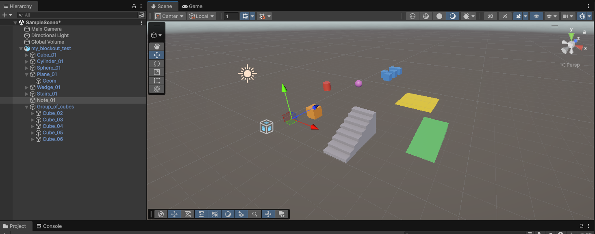

# Taking a Ptah level into Unreal Engine 5 or Unity

Ptah saves your level as a `.usda` file, which both engines can import. This guide covers the import, turning Ptah's gameplay markers into engine objects, and adding collision so you can play the blockout.

## What arrives in the engine

| In Ptah | In the engine |
|---|---|
| Cube, cylinder, sphere, plane, wedge, stairs | A static mesh, coloured by its intent |
| Group | An empty actor / GameObject with the grouped objects inside |
| Note | A named empty (the note's text stays in Ptah) |
| Player start, Spawn, Cover point, Objective | A named empty, until the marker script converts it |
| Trigger volume | A named empty scaled to the box, until the marker script converts it |

Markers draw nothing in the engine until you run the marker script for it: a Trigger is an empty object, not a box. They are empties on purpose. A visible trigger box would get collision in most pipelines and block the player. After conversion, Unity draws each marker as a gizmo in the Scene view (a wire box for a trigger) and Unreal places real actors.

Engine scripts can also read Ptah's gameplay data: blocks carry their **intent** (floor, wall, cover, blocker, water, hazard, interactive, placeholder), markers carry their **kind**, and any object can carry **tags**. Your metrics profile and reference image are saved in the file too; engines ignore them.

**Scale and orientation:** 1 unit in Ptah is 1 cm. Unreal uses centimetres already, and Unity converts to metres on import. Ptah files are Y-up; both importers turn them the right way up.

**Shading:** blocks carry their own normals. Boxes, ramps and stairs keep hard edges, and cylinders and spheres shade round with a hard rim at the caps. Meshes you imported into Ptah carry none, so the engine computes them.

**Names:** each object's name in the engine is its Ptah name, with spaces and symbols replaced (`Wall 01` becomes `Wall_01`). Keep names stable between exports: Unreal's USD Stage actor and Unity's USD import find objects by name and path, and the Unity marker script matches markers by name.

**Pivots:** every block's pivot is its centre, not its base.

## Unreal Engine 5

1. **Edit → Plugins:** enable **USD Importer**, plus **Python Editor Script Plugin** if you will convert markers. Restart the editor.
2. Bring the level in, one of two ways:
   - **Import as assets:** Content Browser → **Import** → pick the `.usda`. Each block becomes a Static Mesh.
   - **Place a USD Stage actor** (Place Actors → **USD Stage**) and set its **Root Layer** to the file. The stage reloads when you save again in Ptah, which is the fastest loop while you block out.
3. **Convert markers.** Copy `tools/unreal/ptah_import.py` somewhere Unreal's Python can find it, then run in the Output Log's Python console:

   ```python
   import ptah_import
   ptah_import.convert("D:/levels/arena.usda")                 # first time
   ptah_import.convert("D:/levels/arena.usda", replace=True)    # after re-exporting: removes the previous run's actors first
   ```

   Without `replace=True`, running it again adds a second set of actors. You get a **PlayerStart** for each Player start, a **TargetPoint** for each Spawn, Cover point and Objective (tagged with its kind and your tags), and a **TriggerBox** sized to each Trigger volume. They go in the Outliner folder `Ptah/<kind>`, named after the Ptah objects.
4. **Collision:** on the imported static meshes, set **Use Complex Collision as Simple** for a quick playable greybox, or let the importer generate simple collision.

## Unity

Use **Unity 6.3 LTS** with Unity's **USD Importer** package. That combination has been checked with a Ptah level: blocks keep their hard edges, cylinders and spheres shade round, and intent colours show.



1. **Window → Package Manager → + → Install package by name:** `com.unity.importer.usd`. Ptah was checked with version 1.0.0-pre.2, a pre-release.
2. Copy the `.usda` into your project's `Assets` folder, or drag it into the Project window. Unity imports it like a model, converting to metres and to Unity's left-handed space.
3. Drag the imported asset into a scene. Each block keeps its Ptah name and its intent colour.
4. **Convert markers:**
   - Copy `tools/unity/Editor/PtahMarkers.cs` into any `Editor/` folder in your project, and `tools/unity/Runtime/PtahMarker.cs` anywhere else.
   - Select the imported root, choose **Tools → Ptah → Convert Markers in Selection…**, and pick the same `.usda`. Selecting a group instead converts only the markers inside it.
   - Every marker gets a **PtahMarker** component with its kind and tags. Player starts are also tagged `Respawn`, and Trigger volumes get a trigger **BoxCollider**.
   - Scripts can find the markers with `GetComponentsInChildren<PtahMarker>()`. A marker's facing is `transform.forward`.
   - Objects are matched by their full path in the level, so two markers with the same name in different groups both convert. If the level is in the scene twice under your selection, the script skips the marker and says so in the Console; select one copy and run it again.
   - The script reads the `.usda` file itself, so it works the same whichever importer brought the level in. It has not been run inside Unity 6.3 yet. After your first conversion, check that a marker's facing (the gizmo's line) points the way its arrow did in Ptah.
5. **Collision:** add a **MeshCollider** to the imported meshes you want to walk on or bump into. Leave triggers to the marker script.

**Older Unity versions** (2022.3 and 2023) can use the earlier **USD** package, `com.unity.formats.usd`, instead. Import with **Assets → Import USD**. Intent colours then come in as vertex colours, so use a vertex-colour material to see them. The marker script works the same way.

## Checking the file first

Open the file in **usdview**, which comes with `pip install usd-core`, to see the geometry, colours and gameplay data before opening an engine.

Outside Unreal, `python ptah_import.py --dry-run level.usda` (with `usd-core` installed) prints what the Unreal script would create.

## Good to know

- There is no standard USD format for gameplay markers, so markers stay empty objects until you run the script for your engine.
- A note's text does not reach the engines. For anything a game script needs to read, use tags on blocks or markers.
- Neither engine script has been run inside a live editor as part of Ptah's automated tests. If something looks wrong, check the Output Log or Console and open an issue on [GitHub](https://github.com/SMUGSterling/Ptah/issues).
